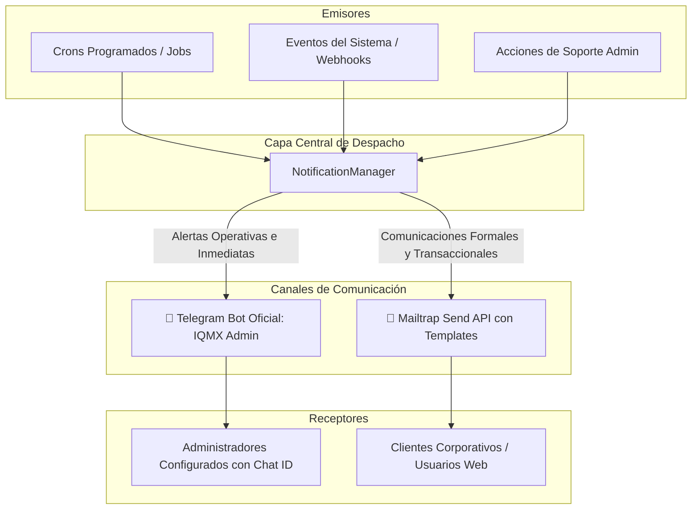

# Plan de Arquitectura: Automatizaciones (Jobs) y Sistema de Notificaciones

**Fecha:** 6 de Septiembre de 2026  
**Proyecto:** Plataforma IQISSMexico (`api` + `crm` + `web`)  
**Estado:** Propuesta de Implementación Técnica  

---

## 1. Visión General y Principio de Operación

El ecosistema de IQISSMexico requiere automatizaciones periódicas (Jobs programados) para gestionar el ciclo de vida de las suscripciones, conciliar el acceso a las herramientas (CRM y Chatbot de WhatsApp), y emitir notificaciones oportunas sin intervención manual.

Para no saturar ni a los administradores ni a los clientes, se aplica una **separación estricta de responsabilidades por canal**:



---

## 2. Catálogo de Automatizaciones (Jobs / Cron Tasks)

Las siguientes tareas programadas se ejecutarán en segundo plano (vía cron en contenedor o scheduler de FastAPI):

### Job 1: Conciliación Diaria y Suspensión de Membresías Vencidas `[COMPLETADO]`
* **Frecuencia / Horario:** Diario a las **00:05 CST** (medianoche).
* **Comando para el Schedule de Coolify:** `python manage.py subscriptions:cron` (simulación previa: `--dry-run`).
* **Propósito:** Identificar suscripciones cuyo `current_period_end` haya expirado (`< now`).
* **Acciones del Job:**
  1. Actualizar el estado de la suscripción en la base de datos central a `expired`.
  2. Si tiene una organización de CRM asociada (`external_tenant_id`), suspender su acceso: `crm.organization.status = 'suspended'`.
  3. Pausar la recepción de nuevos mensajes en las líneas de WhatsApp conectadas para evitar costos de consumo no autorizados.
* **Notificaciones integradas:**
  * 📧 **Al Cliente (Mailtrap):** Envío de plantilla `MAILTRAP_TEMPLATE_EXPIRED` (UUID: `03312624-4bca-4944-b63b-f3f39cc5d6b4`) notificando la pausa del servicio, confirmando que sus datos e historial están protegidos, enlace de reactivación directa y **tarjeta destacada de feedback invitándolo a escribir a WhatsApp** con el motivo por el cual no renovó.
  * 📱 **A los Administradores (Telegram):** **Sin alertamiento individual** por cada cuenta expirada para no saturar el chat operativo en la madrugada. Las bajas se consolidan en el reporte matutino general (**Job 3**).
* **Envío programado (Mailtrap API):** Verificado técnicamente que la API Transaccional de Mailtrap entrega de forma inmediata (no admite `send_at`). El despacho se realiza en tiempo real al ejecutarse el cron a medianoche.

---

### Job 2: Avisos Preventivos Selectivos e Inteligentes (Estrategia Anti-Spam) `[COMPLETADO]`
* **Frecuencia / Horario:** Diario a las **09:00 CST**.
* **Comando para el Schedule de Coolify:** `python manage.py subscriptions:alerts` (simulación previa: `--dry-run`).
* **Propósito:** Alertar **únicamente** en los casos donde la intervención del cliente sea requerida para evitar cortes involuntarios, sin saturar con avisos innecesarios a quienes cuentan con débito automático activo.
* **Filtro Anti-Spam (Regla de Oro):**
  * Si la suscripción cuenta con `mp_preapproval_id` activo (`authorized` en Mercado Pago), **SE OMITE EL AVISO**. Mercado Pago procesará el cobro automáticamente y el cliente no debe ser alarmado a renovar manualmente.
* **Casos Selectivos que Sí Reciben Notificación:**
  1. **Suscripciones Canceladas por el Usuario (-3 Días):**
     * Clientes con `sub.status == 'cancelled'` cuya vigencia concluye en los próximos 3 días.
     * 📧 **Email al Cliente:** Plantilla `MAILTRAP_TEMPLATE_CANCELLED_EXPIRING` (UUID: `18382bc8-7694-45fb-ae98-fd96df453546`) recordando que su membresía concluirá y ofreciendo enlace de reactivación si desea continuar.
  2. **Finalización de Pruebas Gratuitas (-24 Horas):**
     * Clientes con `sub.status == 'trial'` cuyo periodo de gracia gratuito concluye en las próximas 24 horas.
     * 📧 **Email al Cliente:** Plantilla `MAILTRAP_TEMPLATE_TRIAL_EXPIRING` (UUID: `90d1a17d-3ebe-457d-940f-0857dff7a224`) invitándolo a seleccionar su plan oficial para no perder sus números ni integraciones.
  3. **Cobro Recurrente Rechazado (`past_due`):**
     * Clientes cuya tarjeta bancaria fue declinada por fondos insuficientes o expiración.
     * 📧 **Email al Cliente:** Plantilla `MAILTRAP_TEMPLATE_PAYMENT_FAILED` (UUID: `f3e97813-9c70-497e-b553-a332fc0242de`) con llamado urgente a actualizar su tarjeta en el portal.
* **Notificaciones a Admins (Telegram):** Los eventos rutinarios se consolidan en el resumen matutino (Job 3); los fallos bancarios se alertan en tiempo real.

---

### Job 3: Resumen Ejecutivo Matutino (Morning Digest) `[COMPLETADO]`
* **Frecuencia / Horario:** Diario a las **07:00, 08:00 o 09:00 CST** (configurable al programar en Coolify).
* **Comando para el Schedule de Coolify:** `python manage.py digest:morning` (simulación previa: `--dry-run`).
* **Propósito:** Dar al equipo directivo y administrativo visibilidad completa del estado comercial y operativo del día en un solo mensaje conciso en Telegram.
* **Contenido de la Notificación en Telegram:**
  ```text
  ☀️ *IQMX Morning Digest · 07/09/2026*

  📊 *Resumen de las últimas 24 Horas:*
  • Nuevos Leads Validados: 3
  • Renovaciones Procesadas: 4 ($3,196.00 MXN)
  • Cobros Fallidos / Rebotados: 1
  • Cuentas Suspendidas / Expiradas: 1

  ⚠️ *Próximas Pruebas / Cierres (24-48h):*
  • Clínica Dental Juárez (Free Trial concluye el 08/09/2026)

  ✅ Todos los servicios y APIs operando con normalidad.
  ```

---

### Job 4: Limpieza de Claves Efímeras y Archivos Huérfanos `[COMPLETADO]`
* **Frecuencia / Horario:** Semanal, los domingos a las **03:00 CST**.
* **Comando para el Schedule de Coolify:** `python manage.py system:cleanup` (simulación previa: `--dry-run`).
* **Propósito:** Mantenimiento preventivo en Redis y base de datos:
  1. **Higiene de Redis:** Purgar tokens de verificación de correo huérfanos o desincronizados, eliminar tokens residuales de usuarios que ya validaron su correo en PostgreSQL (`email_verified_at is not None`) y forzar la expulsión de claves con TTL expirado o usuarios inexistentes.
  2. **Depuración en PostgreSQL:** Purgar eventos de webhook entregados (`delivered`, `sent`) con más de 30 días de antigüedad y eventos fallidos (`failed`) con más de 60 días.
* **Notificación:** Únicamente genera registro en logs estructurados (sin alertamiento a Telegram a menos que ocurra un error crítico no recuperable).

---

## 3. Matriz de Notificaciones: Clasificación Estratégica

| Evento / Disparador | Canal | Destinatario | Tipo de Mensaje | Propósito y Acción |
| :--- | :--- | :--- | :--- | :--- |
| **Email Verificado** | 📱 **Telegram** | Admins | Notificación inmediata | **Alta prioridad comercial:** Lead calificado listo para contactar por WhatsApp/teléfono. |
| **Bienvenida y Activación** | 📧 **Email** | Cliente | Plantilla corporativa | Entrega enlace seguro para confirmar cuenta y activar portal. |
| **Fallo en Cobro Recurrente** | 📧 **Email** + 📱 **Telegram** | Cliente / Admins | Plantilla urgente | Alerta inmediata de tarjeta rebotada para regularizar antes del corte. |
| **Suscripción Cancelada (-3 días)** | 📧 **Email** | Cliente | Plantilla corporativa | Recordatorio preventivo para reactivar si canceló por error. |
| **Fin de Free Trial (-24 hrs)** | 📧 **Email** | Cliente | Plantilla comercial | Aviso cordial para elegir plan oficial y conservar chatbot/CRM. |
| **Suspensión de Servicio (Día 0)** | 📧 **Email** | Cliente | Plantilla con WhatsApp | Aviso de servicio pausado y botón directo para dar feedback por WhatsApp. |
| **Suspensión de Inquilino CRM** | 📱 **Telegram** | Admins | Alerta operativa | Aviso al equipo admin de que una cuenta fue suspendida por el Job 1. |
| **Renovación Exitosa** | Base de Datos (`payments`) | Sistema | Trazabilidad contable | Registro de transacción mensual con `mp_payment_id` y extensión de vigencia. |

---

## 4. Estandarización de Correos Transaccionales (Mailtrap API)

Para garantizar consistencia de marca y facilitar la creación automatizada de plantillas sin depender de interfaces gráficas manuales, se definen los estándares de diseño institucional.

### A. Estándares de Diseño Visual (Brand Design System)
Todas las plantillas comparten la identidad visual oficial de **IQISSMexico**:

| Elemento | Especificación | Propósito |
| :--- | :--- | :--- |
| **Fondo General** | `#f0f4f8` (Azul/gris suave) | Contraste limpio y lectura descansada. |
| **Cabecera (Header)** | `#0f2a4a` (Navy Institucional) | Bloque corporativo superior con padding generoso. |
| **Logo** | `https://iqissmexico.com/logo.png` | Centrado sobre contenedor blanco redondeado para contraste perfecto. |
| **Tarjeta Central** | `#ffffff`, bordes `16px`, sombra `0 4px 24px rgba(15,42,74,0.08)` | Ancho máximo de `580px` compatible con clientes móviles. |
| **Tipografía** | `-apple-system, 'Segoe UI', Roboto, Helvetica, Arial, sans-serif` | Renderizado nativo y fluido en Outlook, Gmail y Apple Mail. |
| **Botón CTA Principal** | Fondo `#0f2a4a`, texto `#ffffff`, esquinas `10px`, sombra sutil | Botón grande y fácil de presionar en pantallas táctiles. |
| **Caja de Alerta Contextual** | Colores pastel con borde (ámbar, rosa suave o gris) | Destaca fechas límite o avisos críticos sin romper la armonía. |
| **Pie de Página (Footer)** | Fondo `#0f2a4a`, enlaces `#60a5fa`, texto `#94a3b8` | Datos de contacto de soporte y derechos reservados. |

---

### B. Cómo Crear o Actualizar las Plantillas Mediante la API de Mailtrap

Mailtrap permite gestionar plantillas mediante llamadas HTTP autenticadas:

* **Endpoint Oficial:** `POST https://mailtrap.io/api/accounts/{account_id}/email_templates`
* **Headers:**
  * `Api-Token: <MAILTRAP_API_TOKEN>`
  * `Content-Type: application/json`

#### Estructura del Payload JSON:
```json
{
  "email_template": {
    "name": "Nombre de la Plantilla",
    "subject": "Asunto del Correo con {{variable}}",
    "category": "billing",
    "body_html": "<!DOCTYPE html><html>...HTML con diseño estándar...</html>",
    "body_text": "Texto alternativo sin formato para clientes que no soportan HTML."
  }
}
```

---

### C. Catálogo de Plantillas Oficiales y Variables Inyectadas

#### 1. `MAILTRAP_TEMPLATE_WELCOME`
* **Nombre:** Bienvenida y Verificación de Cuenta
* **Asunto:** `¡Bienvenido a IQISSMexico, {{user_name}}! Confirma tu correo`
* **Variables:** `{{user_name}}`, `{{company}}`, `{{verification_url}}`, `{{support_email}}`
* **Estado:** ✅ **Creado y operativo en producción.**

#### 2. `MAILTRAP_TEMPLATE_EXPIRING_3D`
* **Nombre:** Recordatorio Preventivo de Vencimiento (-3 Días)
* **Asunto:** `Tu membresía de {{plan_name}} vence en 3 días - IQISSMexico`
* **Variables:** `{{user_name}}`, `{{company}}`, `{{plan_name}}`, `{{expiry_date}}`, `{{renewal_url}}`
* **Caja de Alerta:** Ámbar suave (`#fffbeb`, borde `#fde68a`) indicando la fecha límite.

#### 3. `MAILTRAP_TEMPLATE_EXPIRING_24H`
* **Nombre:** Aviso Urgente de Vencimiento (-24 Horas)
* **Asunto:** `🚨 Urgente: Tu servicio de IQISSMexico vence en 24 horas`
* **Variables:** `{{user_name}}`, `{{company}}`, `{{plan_name}}`, `{{expiry_date}}`, `{{renewal_url}}`
* **Caja de Alerta:** Rosa suave (`#fff1f2`, borde `#fecdd3`) advirtiendo sobre la pausa inminente del bot.

#### 4. `MAILTRAP_TEMPLATE_EXPIRED`
* **Nombre:** Notificación de Suspensión del Servicio (Día 0)
* **Asunto:** `Tu servicio de IQISSMexico ha sido pausado`
* **Variables:** `{{user_name}}`, `{{company}}`, `{{plan_name}}`, `{{reactivation_url}}`
* **Caja de Alerta:** Gris neutro (`#f1f5f9`, borde `#cbd5e1`) confirmando que los datos y números están a salvo.

---

### D. Herramienta Automatizada: Script de Sincronización

Para crear o actualizar todas las plantillas en Mailtrap garantizando el diseño estándar con un solo comando, se implementó el script:

[api/scripts/sync_mailtrap_templates.py](file:///Users/laclavees12345/code/iqissmexico/main/api/scripts/sync_mailtrap_templates.py)

#### Ejecución:
```bash
# Modo de simulación previa (Dry Run)
docker compose exec -T api python scripts/sync_mailtrap_templates.py --dry-run

# Modo real de creación / sincronización en Mailtrap API
docker compose exec -T api python scripts/sync_mailtrap_templates.py
```

El script genera los 4 correos con el HTML corporativo, los envía a la API de Mailtrap y devuelve los `UUID` correspondientes listos para agregarse al archivo `.env`.
